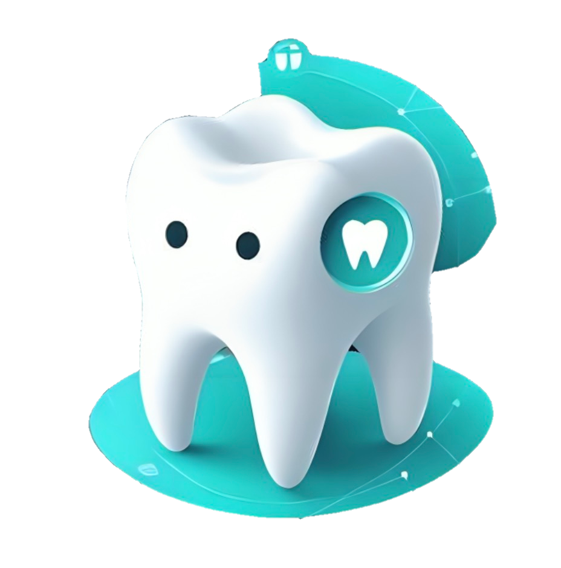
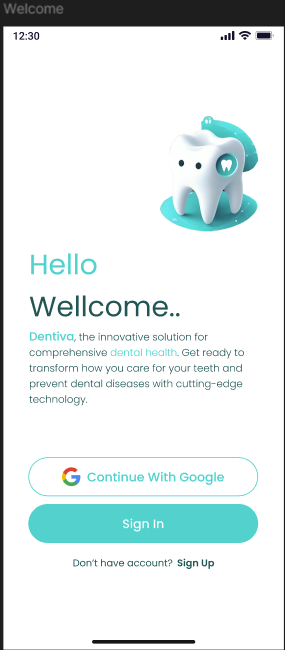
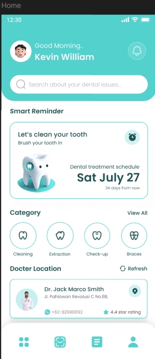
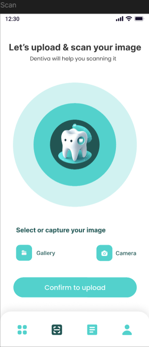
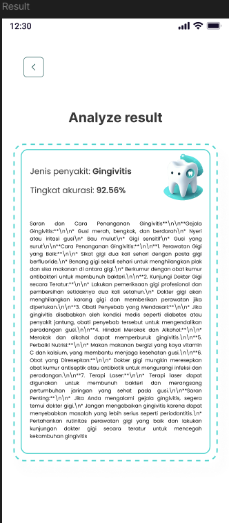
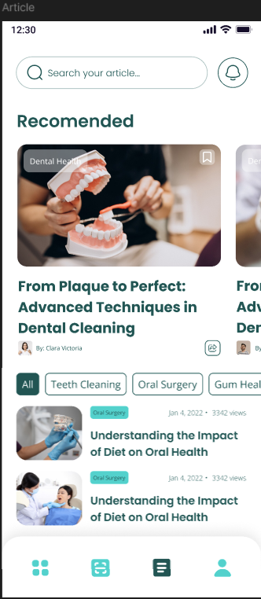
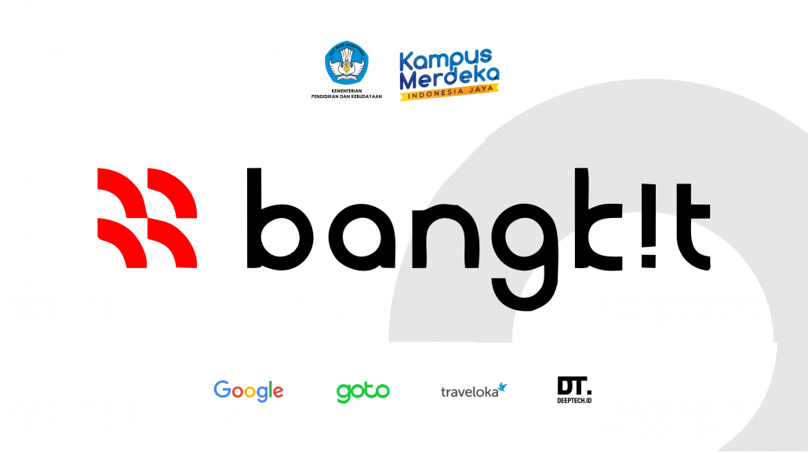

# Dentiva

    

Your Dental Detective for Healthy Mouths

## About Project

Dentiva is an innovative application designed to revolutionize dental healthcare by offering comprehensive solutions for identifying, treating, and preventing dental diseases. With the increasing prevalence of dental issues globally, there is a pressing need for accessible and efficient tools to address oral health concerns. Dentiva aims to fill this gap by leveraging cutting-edge technology to empower users in managing their dental well-being.

## Dentiva Android App

    
    
    
    
    

## Team Member

### Team ID: C241-PS382

|                                         Name                                          |  Student ID  |        Path         |
| :-----------------------------------------------------------------------------------: | :----------: | :-----------------: |
|         [Ridwan Rahmat](https://www.linkedin.com/in/ridwan-rahmat-16721a220/)         | M204D4KY2343 |  Machine Learning   |
|              [Putri Al Zahra](https://www.linkedin.com/in/putrialzahra/)              | M738D4KX2645 |  Machine Learning   |
|         [Dinda Warfani Hasbullah](https://www.linkedin.com/in/dindawarfani/)          | M278D4KX2592 |  Machine Learning   |
|     [Achmad Ryan Fachruddin](https://www.linkedin.com/in/achmad-ryan-f-313baa30a)     | C204D4KY0176 |   Cloud Computing   |
| [Muhammad Alfarel Yudistira](https://www.linkedin.com/in/muhammad-alfarel-yudistira/) | C204D4KY0668 |   Cloud Computing   |
|               [Defri Salwan](https://www.linkedin.com/in/defri-salwan/)               | A251D4KY4306 | Android Development |
|        [Sherlita Diani](https://www.linkedin.com/in/sherlita-diani-586a93258/)        | A229D4KX4575 | Android Development |

## Resource

- Machine Learning Repository: [Dentiva-Machine-Learning](https://github.com/Dentiva-Bangkit/Machine-Learning)
- Cloud Computing Repository: [Dentiva-Cloud-Computing](https://github.com/Dentiva-Bangkit/Cloud-Computing)
- Mobile Development Repository: [Dentiva-Mobile-Development](https://github.com/Dentiva-Bangkit/Mobile-Development)
- API Model Dentiva Repository: [API-Model-Dentiva](https://github.com/Dentiva-Bangkit/API-Model-Dentiva)

## Tools & Technologies

## Acknowledgment

This project was developed for fullfill the final capstone project submission at Bangkit 2024.

